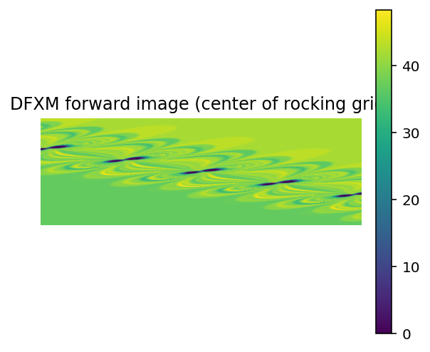
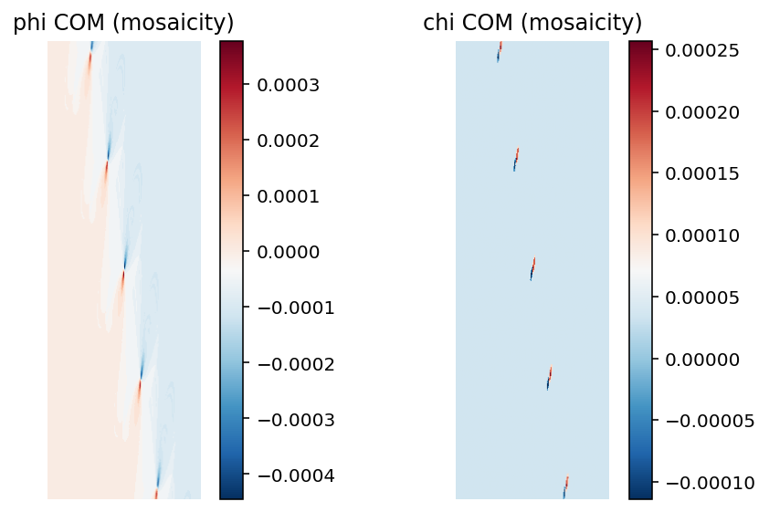

# DFXM Geometrical-Optics Forward Model

A Python implementation of the geometrical-optics forward model for Dark Field
X-ray Microscopy (DFXM), as published in:

> Borgi, S. et al. *J. Appl. Cryst.* (2024).
> DOI: [10.1107/S1600576724001183](https://doi.org/10.1107/S1600576724001183)
> [Article on IUCr](https://journals.iucr.org/j/issues/2024/02/00/nb5370/)

The default beamline configuration matches ID06 at the European Synchrotron
Radiation Facility (ESRF).

## What this code does

Given a crystal containing dislocations, this code simulates the DFXM images
that would be recorded on a detector under a defined beam and goniometer
geometry. It models both the direct-space deformation field around dislocations
and the reciprocal-space resolution function of the microscope.

This is not a generic optics simulator — it is specifically a *forward model*
for dark-field X-ray microscopy at synchrotron sources, used to interpret
images of strain fields and crystal defects.

## Examples

A representative DFXM forward image from a 151-dislocation crystal:



The corresponding mosaicity map (per-pixel COM in φ and χ) from the
post-processing stage:



To regenerate these images locally:

```bash
dfxm-bootstrap --config configs/default.toml      # one-time, ~50 s
python scripts/render_readme_examples.py --small  # ~30 s
```

## Status

Stable. Released as v1.0 (cluster integration; see
[`docs/release-notes-1.0.0.md`](docs/release-notes-1.0.0.md)). The pre-v1
modernization arc is documented at
[`docs/superpowers/plans/2026-05-12-codebase-cleanup.md`](docs/superpowers/plans/2026-05-12-codebase-cleanup.md).

## Quick start

Requires Python 3.11+.

```bash
git clone https://github.com/borgi-s/Geometrical_Optics_master.git
cd Geometrical_Optics_master
python -m venv .venv
source .venv/bin/activate          # Windows: .venv\Scripts\activate
pip install -e ".[dev]"
pytest                             # smoke tests should pass
```

## Running a simulation

The simulation is a two-step workflow: generate the reciprocal-space resolution
kernel pickle once (`dfxm-bootstrap`), then run as many forward simulations
or identification sweeps against it as you like.

```bash
# Step 1 - one-time per environment (~50 s).
dfxm-bootstrap --config configs/default.toml

# Step 2 - many times.
dfxm-forward --config configs/default.toml --output ./out/
```

The CLI runs the forward simulation and post-processing end-to-end (rocking
sweep → image stacks on disk → COM / mosaicity maps → SVG figures). See
[`docs/reproducibility.md`](docs/reproducibility.md) for the config schema and
pre-built dislocation-density variants, and
[`docs/cluster-runs.md`](docs/cluster-runs.md) for cluster deployment.

The pre-v1 single-file demo is preserved at
[`legacy/init_forward.py`](legacy/init_forward.py) as a historical reference.
Use `dfxm-forward` for all new workflows.

## Running on a cluster

`dfxm-forward` and `dfxm-identify` are designed to run on HPC clusters. The
two-step workflow is `dfxm-bootstrap` once per environment, then
`dfxm-forward` / `dfxm-identify` many times. See
[`docs/cluster-runs.md`](docs/cluster-runs.md) for the full walkthrough.

Submit templates live in:

- [`lsf/`](lsf/) — DTU HPC (LSF scheduler, `bsub`)
- [`slurm/`](slurm/) — ESRF (SLURM scheduler, `sbatch`)

Each scheduler ships a single-job template (`forward_single.{bsub,sbatch}`)
and an array template for ML-training sweeps
(`identify_array.{bsub,sbatch}`). Open them and edit the
`>>> EDIT THESE >>>` block at the top to set your queue / partition,
walltime, and memory.

For conda-based cluster installs, use [`environment.yml`](environment.yml):

```bash
conda env create -f environment.yml
conda activate dfxm-geo
pip install -e .
```

## Project structure

```
.
├── src/dfxm_geo/
│   ├── crystal/                 Dislocation fields, rotations, Burgers vectors
│   ├── direct_space/            Direct-space forward simulator + Hg cache
│   ├── reciprocal_space/        Resolution-function Monte Carlo + dfxm-bootstrap
│   ├── analysis/                COM / mosaicity / colormap analysis
│   ├── viz/                     Matplotlib visualisation helpers
│   ├── io/                      Image I/O (parallel save/load, .npy + .edf)
│   ├── constants.py             ID06 beamline defaults
│   └── pipeline.py              Config-driven orchestration + dfxm-forward CLI
├── configs/                     TOML configs (default + variants)
├── lsf/                         DTU HPC batch templates
├── slurm/                       ESRF batch templates
├── scripts/                     Standalone scripts (e.g. render_readme_examples.py)
├── legacy/                      Pre-v1 init_forward.py demo (historical reference)
├── tests/                       pytest suite + golden datasets
└── docs/                        Architecture, physics, reproducibility, cluster guides
```

## Reproducing the paper figures

See [`docs/reproducibility.md`](docs/reproducibility.md) for the current
recipe (`dfxm-forward --config configs/default.toml --output output/` runs
both the simulation and post-processing end-to-end).
Reference datasets are scheduled for Zenodo deposit; until then, contact
the corresponding author.

## Citing

See `CITATION.cff`.

```bibtex
@article{borgi2024dfxm,
  title  = {Geometrical Optics: forward modelling of Dark Field X-ray Microscopy},
  author = {Borgi, Sina and others},
  journal= {Journal of Applied Crystallography},
  year   = {2024},
  doi    = {10.1107/S1600576724001183},
}
```

(Title and full author list need verification against the published paper —
see the `TODO(borgi)` note in `CITATION.cff`.)

## Contributing

PRs welcome. Run `pre-commit run --all-files` before pushing.

## License

MIT. See `LICENSE`.
