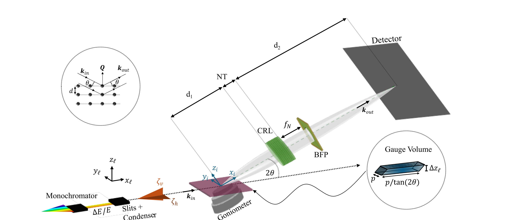
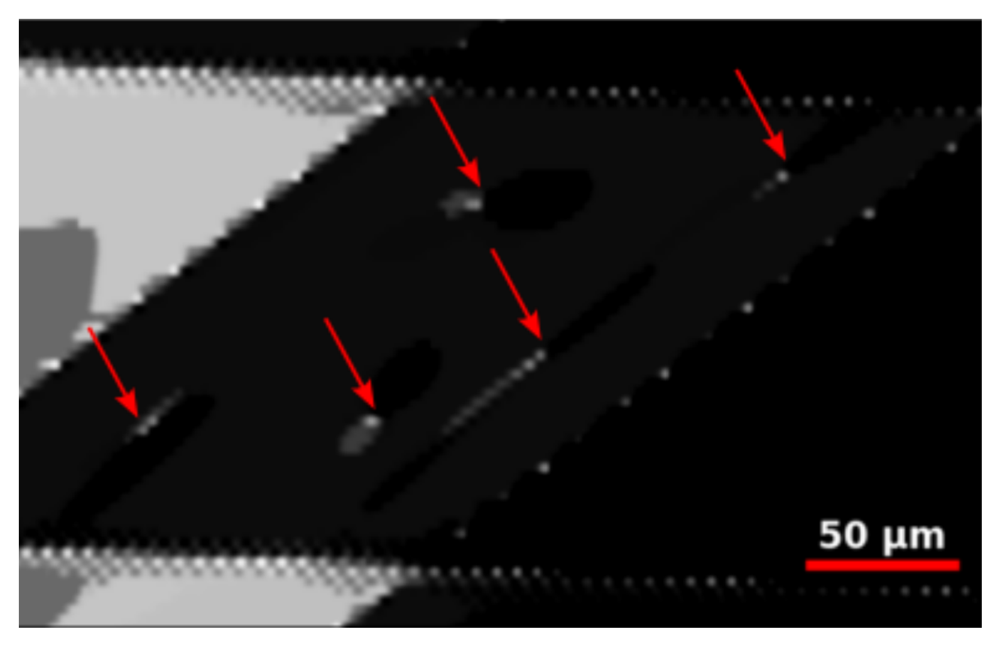
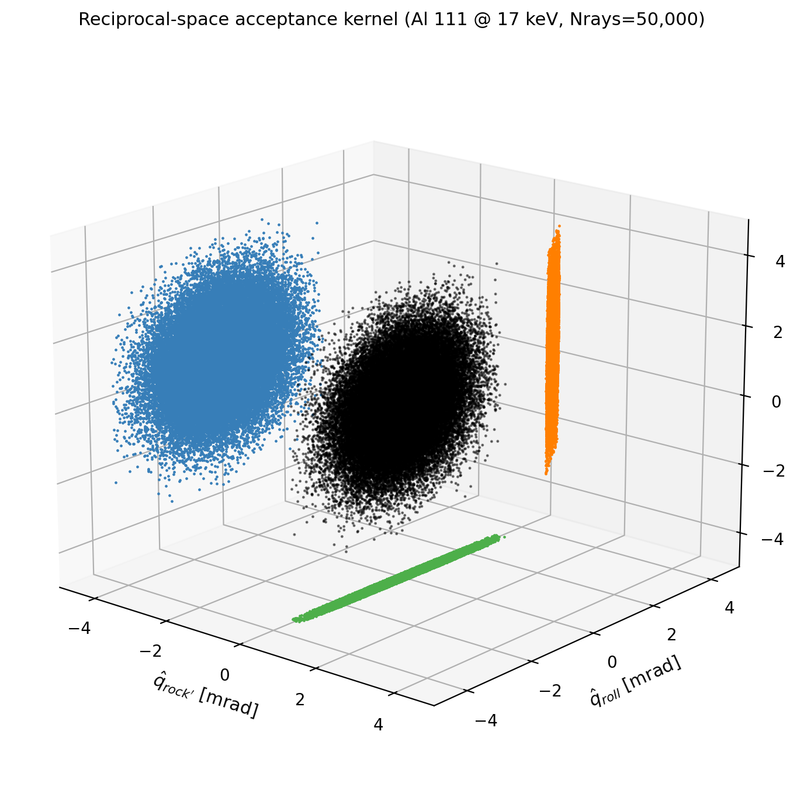
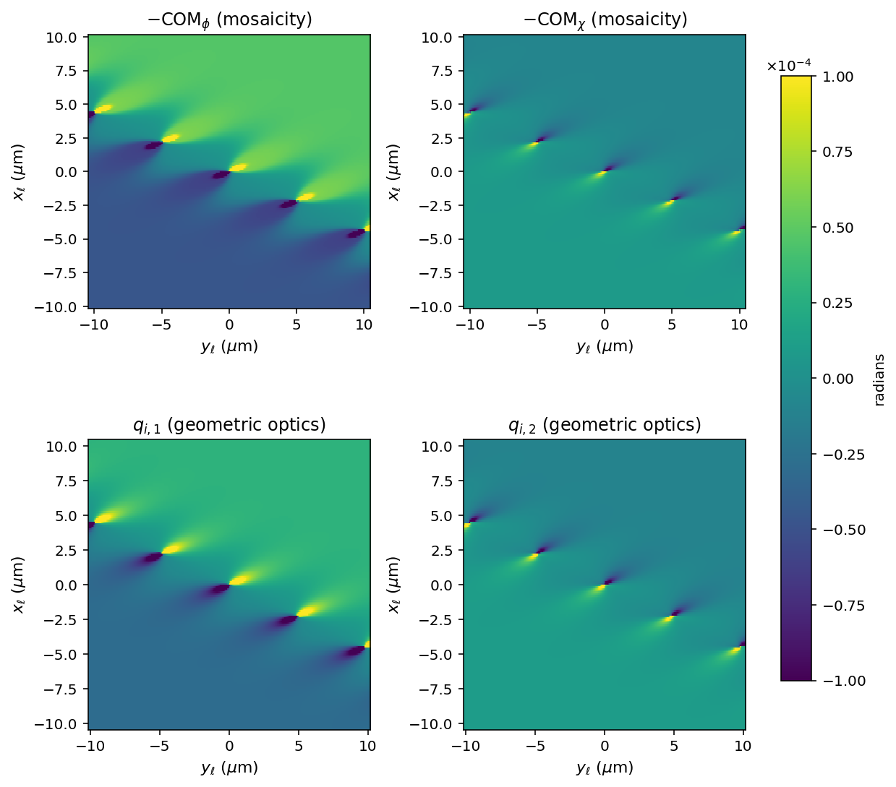

<p align="center">
  
</p>

# DFXM Geometrical-Optics Forward Model

> A physics-based forward model that simulates Dark-Field X-ray Microscopy images of crystals with dislocations — published in the *Journal of Applied Crystallography* (2024).

## What this is

Dark-Field X-ray Microscopy (DFXM) is a synchrotron technique for imaging crystal defects with sub-micron resolution deep inside bulk materials. This package implements the geometrical-optics (GO) forward model described in [Borgi et al., *J. Appl. Cryst.* **57**, 358 (2024)](https://doi.org/10.1107/S1600576724001183). Given a dislocation configuration and a beamline geometry, it computes the expected detector image in two stages:

1. **Reciprocal space** — Monte Carlo ray tracing samples the instrument's angular and energy acceptance through monochromator, slits, condenser, CRL objective, and detector to build a voxelized resolution kernel `Resq_i(q_rock', q_roll, q_2θ)`.
2. **Direct space** — the deformation field around each dislocation (Hirth & Lothe, mixed edge/screw via the slip-system angle α) is rotated into the imaging frame and convolved with the kernel to produce the detector image.

The default configuration targets the **ID06 beamline at ESRF**: Al 111 reflection at 17 keV, 88-lenslet Be CRL, ID06 goniometer geometry.

## What it produces

A typical weak-beam DFXM image with five random edge dislocations in single-crystal aluminium, generated by the pipeline:

<p align="center">
  
</p>

Each dislocation has its own Burgers vector, line direction, and slip-plane normal; the local contrast reflects how the lattice distortion field around each defect couples into the instrument's acceptance.

## How it works — reciprocal space

The reciprocal-space stage draws Monte-Carlo rays from truncated-Gaussian distributions over the incident divergences `(ζ_v, ζ_h)` and energy bandwidth `ΔE/E`, filters them through the CRL numerical aperture, and bins the accepted q-vectors `(q_rock', q_roll, q_2θ)` into a 3D kernel. The figure below shows the raw point cloud for 50 000 rays at the default Al 111 / 17 keV setting:

<p align="center">
  
</p>

The central black cloud is the angular/energy acceptance in the imaging coordinate system; the colored projections show its 2D shadows on each back-wall. Optional `[beamstop]` modes (square aperture in the BFP, knife edge, or absorbing tungsten wire) can be enabled to study weak-beam contrast enhancement.

## How it works — direct space → detector

After the kernel is built, the forward stage rocks the sample through the Bragg condition over a (ϕ, χ) grid and renders the expected detector image at each angle. Taking the per-pixel center of mass of each pixel's rocking curve gives the local lattice tilt — one center-of-mass (COM) map per rocking axis, `COM_ϕ` and `COM_χ` (the two together make up the mosaicity). The geometrical-optics model predicts the same field directly, as the projection `qi` of the deformation onto the imaging axes, so the two should agree. The figure below makes that comparison for a low-angle wall of edge dislocations:

<p align="center">
  
</p>

Top row: the (negated) ϕ and χ center-of-mass (COM) maps extracted from the rocking stack. Bottom row: the geometrical-optics `qi₁` / `qi₂` fields at the z = 0 sample plane. Wall of five edge dislocations, Al 111 @ 17 keV, computed with the v2.1.0 closed-form (analytic) resolution backend; all panels share a fixed ±10⁻⁴ rad color scale. The `−COM ≈ qi` correspondence — each top panel reproducing the one beneath it — recovers the result of [Borgi et al. (2024)](https://doi.org/10.1107/S1600576724001183).

## Stack

- **Language:** Python 3.11+
- **Key libraries:** NumPy, SciPy, h5py, matplotlib
- **HPC:** Batch templates for LSF (DTU Sophia) and SLURM (ESRF clusters); HDF5 / BLISS-schema outputs
- **Testing:** pytest (498 tests) with reference golden datasets
- **License:** MIT

## Install

```bash
pip install dfxm-geo
```

or from source:

```bash
git clone https://github.com/borgi-s/Geometrical_Optics_master.git
cd Geometrical_Optics_master
python -m venv .venv && source .venv/bin/activate     # or .venv\Scripts\activate on Windows
pip install -e ".[dev]"
pytest                                                # smoke tests against reference data
```

## Run

A literally empty `.toml` file is a valid input (since v2.0.0): the empty case produces a single detector image of a single canonical FCC dislocation at the origin, Al 111 reflection at 17 keV.

If you installed from PyPI/wheel (no repo clone), first create local copies of
the config templates:

```bash
dfxm-init   # writes ./configs/default.toml and the rest of the template tree
```

```bash
# one-time bootstrap (generates reciprocal-space kernel ~50 s; reusable thereafter):
dfxm-bootstrap --config configs/default.toml

# forward simulation:
dfxm-forward    --config configs/default.toml   --output ./run_output

# dislocation identification (image-to-library matching):
dfxm-identify   --config configs/identification_single.toml --output ./id_output
```

Every block in `configs/default.toml` shows the value the pipeline would use if the block were omitted — edit any block to override, delete to fall back to the default. For larger parameter sweeps, see `lsf/` and `slurm/` for ready-to-submit batch scripts. Output is written to a BLISS-schema HDF5 file (master + per-scan layout) that `silx` and `darfix` can consume directly.

## Cite

If this code or the model is useful in your work, please cite:

> Borgi, S., Ræder, T. M., Carlsen, M. A., Detlefs, C., Winther, G., & Poulsen, H. F. (2024). *Simulations of dislocation contrast in dark-field X-ray microscopy.* Journal of Applied Crystallography **57**, 358–368. [doi:10.1107/S1600576724001183](https://doi.org/10.1107/S1600576724001183)

A second paper applying the model to individual-dislocation identification:

> Borgi, S., Winther, G., & Poulsen, H. F. (2025). *Individual dislocation identification in dark-field X-ray microscopy.* J. Appl. Cryst. **58**, 813–821.

## Background

Developed during PhD research at DTU Physics in collaboration with ESRF (European Synchrotron Radiation Facility). The forward model is a Python port and substantial extension of the MATLAB script first introduced by Poulsen et al., *J. Appl. Cryst.* **54**, 1555 (2021). The microscope schematic and example output above are adapted from S. Borgi, *Dislocation identification using dark-field X-ray microscopy in bulk single-crystalline materials* (PhD thesis, DTU Physics, 2025), Chapter 3.

## Roadmap

Released: v2.0.0 (2026-05-23) — empty-TOML defaults, `WallCrystalConfig` defaults stripped (breaking), BLISS-schema HDF5 output, identification → HDF5. Next: Zenodo deposit of reference datasets; expanded multi-reflection support beyond Al; darling/darfix interop polish (see follow-up issues).
