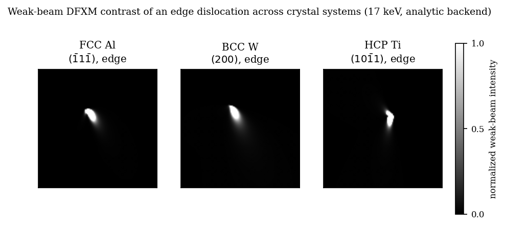

# Crystal structures

How `dfxm-geo` models dislocation physics in FCC, BCC, and HCP crystals —
slip-system selection, Burgers vector magnitudes, isotropic Poisson ratios,
and the configuration TOML keys that control them.

## Structure resolution

Before the simulation runs, the code resolves a single *structure type* string
(`"fcc"`, `"bcc"`, or `"hcp"`) that determines which slip-system table to load.
The precedence is:

| Source | When present | Overrides |
|---|---|---|
| Space group | `[crystal] space_group = "..."` or CIF file | everything — if an explicit `structure_type` *contradicts* the space group, the run aborts with an error |
| Explicit `structure_type` | `[crystal] structure_type = "bcc"` | the default |
| Default | nothing set | falls back to `"fcc"` (back-compat with v2.x) |

Space-group-to-structure mapping:

| Bravais lattice | Representative space groups | Derived type |
|---|---|---|
| F-cubic | Fm-3m, F4-3m, … | `"fcc"` |
| I-cubic | Im-3m, I4-3m, … | `"bcc"` |
| P-hexagonal | P6₃/mmc, P6/mmm, … | `"hcp"` |

Contradicting the space group is an error:

```toml
[crystal]
cif = "Fe.cif"        # space group Im-3m → bcc
structure_type = "fcc"  # Error: contradicts Im-3m
```

## Supported structures and slip systems

### FCC — {111}⟨110⟩

The classic 12 slip systems on the four {111} planes:

| Plane family | Burgers family | Unique planes | Systems per plane | Total |
|---|---|---|---|---|
| {111} | ⟨110⟩ | 4 | 3 | 12 |

The order of the 12 systems is fixed to the v2.x `_SLIP_SYSTEM_111` sequence
for bit-identity: `random_dislocations` draws `rng.integers(0, 12)` into this
ordered list, and `wall` mode uses entry [0]. A symmetry-completeness assertion
runs at import time to guarantee the set is unchanged.

Only one slip family is registered for FCC and `slip_families` has no
effect.

### BCC — {110}⟨111⟩ + {112}⟨111⟩

By default, both principal slip families are active, giving 24 systems across
18 distinct planes:

| Family | Unique planes | Systems | Systems per plane |
|---|---|---|---|
| {110}⟨111⟩ | 6 | 12 | 2 |
| {112}⟨111⟩ | 12 | 12 | 1 |
| **Both (default)** | 18 | **24** | — |

The {123}⟨111⟩ "pencil glide" family is **not** in the built-in registry.
If you need it, use the `[[crystal.slip_system]]` escape hatch (see below).

#### Narrowing to one BCC family

```toml
[crystal]
structure_type = "bcc"
slip_families = ["{110}<111>"]   # only the 12 primary systems
```

Valid names for `slip_families` are `"{110}<111>"` and `"{112}<111>"`.
Supplying an unknown name raises an error listing the available options.

### HCP — basal, prismatic, and pyramidal families

Five slip families are registered, giving 30 systems in total:

| Family (4-index name) | Planes | Systems | Burgers type |
|---|---|---|---|
| {0001}⟨11-20⟩ — basal | 1 | 3 | ⟨a⟩ |
| {10-10}⟨11-20⟩ — prismatic | 3 | 3 | ⟨a⟩ |
| {10-11}⟨11-20⟩ — 1st-order pyramidal ⟨a⟩ | 6 | 6 | ⟨a⟩ |
| {10-11}⟨11-23⟩ — 1st-order pyramidal ⟨c+a⟩ | 6 | 12 | ⟨c+a⟩ |
| {11-22}⟨11-23⟩ — 2nd-order pyramidal ⟨c+a⟩ | 6 | 6 | ⟨c+a⟩ |
| **Total (default)** | 16 distinct | **30** | — |

All five families are active by default. Use `slip_families` to narrow the set:

```toml
[crystal]
structure_type = "hcp"
slip_families = ["{0001}<11-20>", "{10-11}<11-23>"]   # basal + 1st-order pyramidal ⟨c+a⟩
```

Valid family name strings (use these exact strings in `slip_families`):

- `"{0001}<11-20>"`
- `"{10-10}<11-20>"`
- `"{10-11}<11-20>"`
- `"{10-11}<11-23>"`
- `"{11-22}<11-23>"`

Supplying an unknown name raises an error listing the available options.

#### 4-index Miller–Bravais notation

Hexagonal planes and directions are conventionally written in 4-index notation
(h k i l) / [u v t w]. `dfxm-geo` accepts length-4 tuples wherever a plane
or Burgers direction is required and converts them internally to the 3-index
form used by the physics engine:

- **Plane** (h k i l), with i = −(h+k): drop the redundant i → (h, k, l).
- **Direction** [u v t w], with t = −(u+v): U = 2u+v, V = u+2v, W = w, then
  divide by gcd.

Both `slip_plane_normal` in the identification config and the
`[[crystal.slip_system]]` escape hatch accept 4-index lists:

```toml
[crystal]
slip_plane_normal = [0, 0, 0, 1]   # (0001) basal → stored as (0, 0, 1)
```

```toml
[[crystal.slip_system]]
plane   = [0, 0, 0, 1]             # (0001) in 4-index — accepted
burgers = [2, -1, -1, 0]           # [2-1-10] in 4-index — accepted
```

#### Orthonormal mount requirement for hexagonal cells

The default mount `(1,0,0)/(0,1,0)/(0,0,1)` assumes an orthonormal basis and
is **NOT orthogonal for a hexagonal cell** (the a* and b* reciprocal vectors
subtend 60°). Supplying the default mount for an HCP crystal raises an error.

Use a mount whose reciprocal-space vectors are mutually orthogonal, for example:

```
mount_x = [2, -1, 0]
mount_y = [0,  1, 0]
mount_z = [0,  0, 1]
```

The mount validator checks orthogonality of the **reciprocal-lattice**
directions `B·m` (the plane normals): `B·[2,-1,0]` and `B·[0,1,0]` are mutually
orthogonal for a hexagonal cell. Both Miller vectors lie in the basal plane
(zero `l`); the third direction `[0,0,1]` maps to the c*-axis, completing an
orthogonal frame. (The real-space `A·m` directions are *not* checked and are
not orthogonal here — `A·[2,-1,0]` and `A·[0,1,0]` subtend ~139°.) This mount
is used in all HCP examples and tests.

#### HCP requires oblique geometry

Like BCC, HCP requires oblique geometry (`[geometry] mode = "oblique"`) because
the crystal mount (and hence the scattering geometry) must be specified
explicitly. Simplified mode (`mode = "simplified"`) discards the mount and
cannot carry HCP slip-system information — attempting to use it with
`structure_type = "hcp"` raises an error pointing to oblique mode.

#### Picking a reachable reflection

Not every reflection (h, k, l) is Laue-reachable at a given keV for a given
mount. Use `dfxm_geo.crystal.oblique.compute_omega_eta` to check:

```python
from dfxm_geo.crystal.oblique import CrystalMount, compute_omega_eta
import numpy as np

mount = CrystalMount(
    lattice="hexagonal", a=2.951e-10, c=4.684e-10,
    structure_type="hcp",
    mount_x=(2, -1, 0), mount_y=(0, 1, 0), mount_z=(0, 0, 1),
)
geom = compute_omega_eta(mount, hkl=(1, 0, -1), keV=17.0)
eta = geom.eta_1 if not np.isnan(geom.eta_1) else geom.eta_2
print(f"eta = {eta:.6f}")   # put this value in [geometry] eta
```

The paper's preferred basal reflection **(0002) is NOT Laue-reachable at 17 keV**
for the `(2,-1,0)/(0,1,0)/(0,0,1)` mount — `compute_omega_eta` returns NaN η
for both Ti and Mg. The end-to-end tests use **(1, 0, -1)** instead (≈ −2.08 rad
for Ti at 17 keV), which is a 1st-order pyramidal reflection and IS reachable.
Use `dfxm-find-reflections` to explore which reflections are accessible for
your material, mount, and keV.

## Forward contrast across crystal systems

All three supported structure families render end to end on the kernel-free
analytic backend. The figure below shows one weak-beam DFXM image of a pure-edge
dislocation in FCC aluminium, BCC tungsten and HCP titanium, all at 17 keV
(reproduce with `python scripts/render_structure_showcase.py --figures`):



These renders are locked as golden regressions in
`tests/test_structure_goldens.py` (Stage 4.4 validation), so a silent change to
the forward physics of any structure family fails the suite.

## TOML configuration examples

### Explicit structure type

```toml
[crystal]
structure_type = "bcc"
material = "Fe"            # sets ν from the Poisson table (0.29, [KL])
lattice = "cubic"
a = 2.87                   # Å — α-iron lattice parameter
mount_x = [1, 0, 0]
mount_y = [0, 1, 0]
mount_z = [0, 0, 1]
```

### CIF-driven (space group inferred automatically)

```toml
[crystal]
cif = "Fe.cif"             # space group Im-3m → bcc (authoritative)
material = "Fe"
# lattice + a are populated from the CIF; mount_x/y/z remain TOML-only
mount_x = [1, 1, 0]
mount_y = [-1, 1, 0]
mount_z = [0, 0, 1]
```

`cif` requires `pip install "dfxm-geo[cif]"` (or `conda install -c conda-forge gemmi`).
The path is resolved relative to the config file's directory.

### HCP oblique (Ti, forward mode)

```toml
[reciprocal]
hkl   = [1, 0, -1]          # 1st-order pyramidal reflection — reachable at 17 keV
keV   = 17.0
backend = "analytic"
beamstop = false

[geometry]
mode = "oblique"
eta  = -2.0818               # from compute_omega_eta; exact value required

[crystal]
lattice = "hexagonal"
a = 2.951e-10                # α-Ti, metres
c = 4.684e-10
structure_type = "hcp"
material = "Ti"              # sets ν = 0.32 (KL)
mount_x = [2, -1, 0]
mount_y = [0,  1, 0]
mount_z = [0,  0, 1]
mode = "random_dislocations"

[crystal.random_dislocations]
ndis  = 10
seed  = 42
sigma = 8.0                  # µm spread
```

### Custom slip systems (escape hatch)

For non-standard families such as {123}⟨111⟩ BCC pencil glide, or
for any crystal structure not in the built-in registry, use the
`[[crystal.slip_system]]` array-of-tables block:

```toml
[crystal]
# structure_type must NOT be set when using [[crystal.slip_system]]
material = "Fe"
mount_x = [1, 0, 0]
mount_y = [0, 1, 0]
mount_z = [0, 0, 1]

[[crystal.slip_system]]
plane = [1, 2, 3]
burgers = [1, 1, 1]    # b·n must equal zero — [1,1,1]·[1,2,3] = 1+2+3 = 6 → error

[[crystal.slip_system]]
plane = [1, 2, 3]
burgers = [1, -1, 0]   # 1·1 + 2·(-1) + 3·0 = 0 ✓ — valid glide system
```

Each entry is stored as a *literal* slip system (no symmetry-orbit
expansion). The validator enforces **b·n = 0** (glide condition); providing
a non-glide pair raises `ValueError`. Entries are enumerated in the order
they appear in the TOML file.

`structure_type` and `[[crystal.slip_system]]` are mutually exclusive —
setting both raises an error.

### Oblique-η requirement (BCC and HCP)

A single-reflection oblique run (BCC or HCP) requires an **exact** η value (the
azimuthal angle at which the reflection satisfies the diffraction condition
for the given mount). The `[geometry]` validator cross-checks the supplied
`eta` against `compute_omega_eta` and raises if it does not match.
Supplying `eta = 0.0` will be rejected unless 0 happens to be the correct
value for your mount:

```toml
# ❌ likely to fail: eta=0.0 is rarely correct for a BCC or HCP oblique run
[geometry]
mode = "oblique"
eta = 0.0
```

**Workaround:** use the multi-reflection `[[reflections]]` syntax, which
permits omitting η (the solver finds all valid (ω, η) pairs internally):

```toml
[[reflections]]
hkl = [1, 1, 0]
# eta omitted — the solver finds valid geometry automatically
```

Or supply the correct η from `dfxm_geo.crystal.oblique.compute_omega_eta`
before writing the TOML:

```python
from dfxm_geo.crystal.oblique import CrystalMount, compute_omega_eta
import numpy as np

# BCC example (Fe)
mount = CrystalMount(lattice="cubic", a=2.87e-10, structure_type="bcc",
                     mount_x=(1,1,0), mount_y=(-1,1,0), mount_z=(0,0,1))
geom = compute_omega_eta(mount, hkl=(1, 1, 0), keV=17.0)
eta = geom.eta_1 if not np.isnan(geom.eta_1) else geom.eta_2
print(f"eta = {eta:.6f}")   # put this value in [geometry] eta
```

## Burgers vector magnitudes

The Burgers magnitude |b| used in the displacement-field formula depends on
the crystal structure.

### FCC (Al, Cu, Ni, …)

For backward-compatibility with v2.x, the FCC magnitude is the **historical
constant**:

```
BURGERS_VECTOR = 2.862e-4 µm   (hard-coded in dfxm_geo.constants)
```

This value matches the Al (−1, 1, −1) reference from the Borgi et al. (2024)
paper. All FCC simulations use this constant regardless of the actual lattice
parameter in the TOML — changing `[crystal] a` for FCC does **not** alter |b|.

### Non-FCC (BCC, HCP, custom)

For BCC, HCP, and custom structures, |b| is derived from the cell matrix **A**
and the integer Burgers direction **b_int**:

```
|b| = fraction × |A · b_int|   (in µm, A in metres)
```

where the lattice-translation fraction is 1/2 for the ⟨111⟩_bcc
centered-lattice primitive translation, and 1.0 for HCP (the registry stores
the reduced full-translation integer direction — no centered-lattice halving).

For the two BCC families:

| Family | Burgers direction | Formula | Example (α-Fe, a = 2.87 Å) |
|---|---|---|---|
| {110}⟨111⟩ | ½⟨111⟩ | a√3/2 | 2.485 × 10⁻⁴ µm |
| {112}⟨111⟩ | ½⟨111⟩ | a√3/2 | 2.485 × 10⁻⁴ µm |

Both BCC families share the same Burgers direction family ⟨111⟩, so they give
the same |b|.

### HCP — c/a-dependent Burgers magnitude

HCP has two distinct Burgers-vector lengths depending on the dislocation type:

| Type | Integer direction (3-index) | Formula | Example (α-Ti, a = 2.951 Å, c = 4.684 Å) |
|---|---|---|---|
| ⟨a⟩ (basal, prismatic, pyr-⟨a⟩) | [1,0,0], [0,1,0], [1,1,0] | a | 2.951 × 10⁻⁴ µm |
| ⟨c+a⟩ (pyr 1st- and 2nd-order) | [1,0,1], [1,0,-1], … | √(a²+c²) | 5.537 × 10⁻⁴ µm |

The magnitude is computed per-dislocation from the cell parameters (Task 3/6 of
M4 Stage 4.3b). In a `random_dislocations` run each drawn dislocation carries
its own |b|, so a single simulation will contain a mix of ⟨a⟩ and ⟨c+a⟩
contributions when all five families are active.

## Poisson ratio

The displacement-field formula (Hirth & Lothe isotropic elasticity) requires a
Poisson ratio ν. Resolution precedence:

1. `[crystal] poisson_ratio = <value>` — explicit override (takes any float).
2. `[crystal] material = "<element>"` — looked up in the built-in table.
3. Default — falls back to Al: ν = 0.334 (source: [SW]).

### Built-in Poisson table

| Material | Symbol | Structure | ν | Source |
|---|---|---|---|---|
| Aluminium | Al | FCC | 0.334 | [SW] |
| Copper | Cu | FCC | 0.34 | [SW] |
| Nickel | Ni | FCC | 0.31 | [KL] |
| Iron (α) | Fe | BCC | 0.29 | [KL] |
| Tungsten | W | BCC | 0.28 | [KL] |
| Titanium (α) | Ti | HCP | 0.32 | [KL] |
| Magnesium | Mg | HCP | 0.29 | [SW] |

Values are polycrystalline Voigt-Reuss-Hill (VRH) aggregate averages.

**Full references:**

- **[KL]** Kaye, G. W. C. & Laby, T. H. *Tables of Physical and Chemical
  Constants*, 16th ed. Longman, 1995. Sec. 2.3.4 (elastic properties of
  polycrystalline solids).
- **[SW]** Simmons, G. & Wang, H. *Single Crystal Elastic Constants and
  Calculated Aggregate Properties: A Handbook*, 2nd ed. MIT Press, 1971
  (VRH aggregate ν).

The Ti and Mg entries are used by HCP simulations (M4 Stage 4.3b). Setting
`material = "Ti"` or `material = "Mg"` with `structure_type = "hcp"` resolves
the Poisson ratio and contributes it to the HDF5 provenance attrs.

## Structure provenance in HDF5 output

For **structure-aware runs** (oblique geometry or any run with a non-trivial
crystal mount), the `/N.1/` scan entry in the master HDF5 carries the
following additional attributes:

| Attr | Type | Example | Notes |
|---|---|---|---|
| `structure_type` | string | `"bcc"` | Resolved structure family |
| `poisson_ratio` | float64 | `0.29` | Resolved ν |
| `poisson_source` | string | `"KL"` | `"KL"`, `"SW"`, or `"override"` |
| `burgers_magnitude_um` | float64 | `2.485e-4` | \|b\| in µm for the primary slip family |
| `material` | string | `"Fe"` | Only present if `[crystal] material` was set |
| `slip_families` | list[string] | `["{110}<111>"]` | Only present if `slip_families` was set (HCP: always present) |
| `space_group` | string | `"Im-3m"` | Only present if derived from a space group or CIF |
| `c_over_a` | float64 | `1.587` | **HCP only** — c/a ratio from the cell parameters |

These attrs are written by `dfxm_geo.io.hdf5.structure_provenance_attrs`
and are appended to the same `/N.1/` attrs that carry `scan_mode`,
`scanned_axes`, and `crystal_mode` (see `docs/output-format.md`).

**FCC simplified path:** when `mount` is `None` (the default for a symmetric
FCC run with no `[crystal] cif` or `structure_type` set), **none** of these
attrs are written. The forward and identify outputs remain byte-identical to
v2.5.x in this case.

## GNB walls — geometrically-necessary boundaries

`dfxm-geo` can also simulate a **geometrically-necessary boundary** (GNB) — a
planar dislocation wall whose composition is fixed by the Frank equation for a
prescribed misorientation angle θ.  Set `[crystal] mode = "gnb"` to activate
this path.

See **[docs/gnb-walls.md](gnb-walls.md)** for the full description: built-in
recipes (`leds_eq11`, `leds_eq14`, `frankus`), the θ knob and dislocation
spacing, `extent_um` semantics, simplified vs. oblique geometry, and the
`custom` recipe escape hatch.

## Limitations

**Isotropic elasticity only.** The displacement field implemented in
`crystal/dislocations.py` uses the Hirth & Lothe isotropic solution with a
single scalar ν. This applies equally to FCC, BCC, and HCP crystals.
Anisotropic single-crystal elasticity (the full C_ijkl tensor — e.g.
C₁₁, C₁₂, C₄₄ for cubic; C₁₃, C₃₃, C₄₄ for HCP) is **not** implemented
and is out of scope for v3.0.0. For materials with strong elastic anisotropy
(W, Ni, Ti with high c/a-ratio variants), the isotropic VRH average is a
reasonable first approximation for bulk polycrystalline aggregates, but
per-grain anisotropic contrast will differ from the isotropic prediction.

**{123}⟨111⟩ BCC (pencil glide) only via the escape hatch.** The built-in
registry covers {110} and {112} BCC families. The {123} family is physically
active in BCC metals at elevated temperatures; it can be added via
`[[crystal.slip_system]]` entries (one per system, no symmetry expansion).

**Non-HCP hexagonal / trigonal structures use the HCP registry.** The
`derive_structure_type` function maps all P-hexagonal space groups to `"hcp"`.
If your trigonal or hexagonal crystal has a genuinely different slip system
set, use the `[[crystal.slip_system]]` escape hatch to specify systems
explicitly.

**HCP requires oblique geometry.** Simplified mode (`[geometry] mode =
"simplified"`) does not carry a crystal mount and cannot serve HCP
simulations — attempting to use it with `structure_type = "hcp"` raises an
error. Use `mode = "oblique"` with an orthonormal mount (see the HCP section).

**Non-cubic `wall` mode is now frame-correct (BCC and HCP).** The forward `wall` path
(`Find_Hg`) accepts an optional `Ud_override`: for a non-cubic (BCC/HCP) wall the orchestrator
passes the population's cell-aware `Ud` (`population.Ud[0]`, built by
`_ud_matrix_from_bnt_cell` from the structure's first slip system), so a `mode = "wall"` forward
renders in the correct crystal frame just like `centered` and `random_dislocations`. FCC walls
keep `Ud_override = None`, which uses the legacy module-global FCC wall `Ud` — byte-identical to
v2.x (note that the legacy FCC wall `Ud` is a *different* {111}⟨110⟩ system than
`slip_systems("fcc")[0]`, which is why FCC must NOT be routed through `population.Ud[0]`).

> **Fg-cache caveat (deferred repo-audit #1).** The `Find_Hg` Fg cache filename is keyed by
> `dis/psize/zl_rms/Npixels/Nsub/remount/z/b/ν` — NOT by `Ud` or `theta_0`. For FCC the wall
> `Ud` is constant so this is safe; for non-cubic the `b`/`ν` suffixes differentiate
> structures/materials in practice. Now that the wall `Ud` is structure-dependent, a future
> non-FCC run with the same `b`/`ν`/`theta` but a *different* `Ud` would collide on the cache
> key. Making the Fg cache key geometry/structure-aware is tracked as a separate follow-up.
