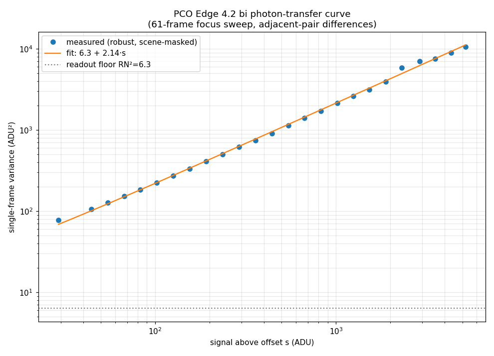
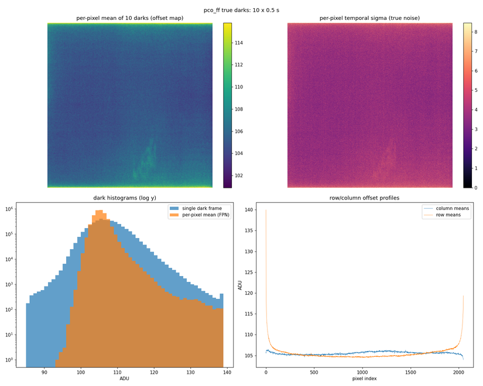

# Detector noise model

The forward and identification pipelines render a noiseless, sampling-normalized
intensity image, then (when `[detector] model != "ideal"`) convert it to a
realistic uint16 ADU frame statistically indistinguishable from a raw ID03 PCO
Edge 4.2 bi frame. The conversion is

```
adu = ideal_intensity * counts_scale * exposure_time      # then noise
```

with the noise composition (gain-scaled Poisson + exposure-dependent offset +
fixed-pattern map + read/dark-shot Gaussian) implemented in
`src/dfxm_geo/detector.py` (`DetectorModel.apply`). The fitted `pco_edge_4.2_id03`
parameters (gain 2.14 ADU/photon, offset 102.5 + 7.5·t ADU, read noise 2.5–3 ADU)
come from Sina's ID03 beamtime calibration data; the full fit method and figures
are documented below.

---

## 1. Measured noise parameters

Fitted 2026-06-12 from Sina's ID03 data (PCO Edge 4.2 bi + scintillator,
`pco_ff`, 2048×2048, 6.5 µm pixels). The experimental frames are **local only
— not in the repo** (`C:\Users\borgi\Documents\GM-reworked\experimental_data\`);
reading them requires `hdf5plugin` (bitshuffle) imported before `h5py.File`.

Datasets used:

- `bicrystal_111_layer_rocking_scans_darks/scan0001` — 10 × 0.5 s true darks
  (shutter closed) → offset, readout σ, FPN, hot pixels.
- `bicrystal_111_find_x_edge` scans 0054/0058 (0.1 s, near-dark) and
  scan0002 (1 s, near-dark) → offset vs exposure cross-check.
- `111_individual_dislocations_10x_focusing_2/scan0001` — 61 × 1 s focus sweep
  → photon-transfer curve via adjacent-pair differences with drift normalization
  and a boxcar scene-change mask.

| parameter | value | source |
|---|---|---|
| offset | `102.5 + 7.5·t` ADU (t = exposure in s) | darks + near-darks at 0.1/0.5/1 s, all consistent |
| readout noise σ_R | 2.5–3.0 ADU, Gaussian | photon-transfer intercept (RN² = 6.3) + dark temporal σ |
| dark-accumulation noise | folded into σ(t): var ≈ 6.3 + 11·t ADU² | dark temporal σ at 0.1 s vs 0.5 s |
| gain g | **2.14 ADU per photon-equivalent** | photon-transfer slope, linear 30–5000 ADU |
| quantization | integer ADU, uint16, clamp 65535 | raw LIMA frames |
| FPN | σ ≈ 1.8 ADU (robust), Gaussian-ish | per-pixel mean of darks |
| warm pixels | 0.57 % above median+10 ADU | darks |
| hot pixels | ~1.1×10⁻⁴ fraction above median+50 ADU | darks |
| row structure | first/last ~16 rows elevated (up to ~35 ADU p2p) | dark row profile |
| image persistence ghost | faint, present in darks | NOT modeled (v2 candidate) |

---

## 2. Model equation

Noise composition for one pixel with ideal signal `s` ADU above offset:

```
adu = round( g · Poisson(s / g) + offset(t) + FPN_px + Normal(0, σ(t)) )
adu = clip(adu, 0, 65535) as uint16
```

where:

- `offset(t) = 102.5 + 7.5·t` (offset_base + dark_rate × t)
- `σ(t) = sqrt(6.3 + 11·t)` (combined readout + dark-accumulation noise)
- `g = 2.14` ADU per photon-equivalent
- `FPN_px` is drawn once from a Gaussian(0, 1.8 ADU) per pixel and held fixed
  across all frames in a run (synthetic fixed-pattern map, seeded from the
  config seed chain)

`g · Poisson(s/g)` reproduces the measured variance `g·s` exactly; the
scintillator excess-noise factor is inside the fitted `g` by construction.

This is what `DetectorModel.apply` in `src/dfxm_geo/detector.py` computes,
using the preset `PCO_EDGE_4P2_ID03` (offset_base=102.5, dark_rate=7.5,
read_noise_var_base=6.3, read_noise_var_rate=11.0, gain=2.14, fpn_sigma=1.8,
tail_fraction=0.015, tail_scale=10.0, edge_rows=16, edge_peak=20.0,
edge_decay=4.0).

---

## 3. Photon-transfer fit method

The gain (2.14 ADU/photon) was measured from the 61-frame focus sweep using
**adjacent-pair differences** (script: `docs/calibration/fit_gain.py`):

1. For each adjacent frame pair (i, i+1), normalize the global drift by
   rescaling frame i+1 to match the illuminated mid-band sum.
2. Difference the normalized pair: `d = cur/r − prev`. Because scene content
   nearly cancels, the variance of `d` is `2·var(single)`.
3. Reject scene-change pixels: apply a boxcar smooth (7×7) to `d`; pixels
   where the smoothed signal exceeds 3× the expected photon noise are masked.
   This discards spatially correlated scene changes (dislocation motion, beam
   drift) while keeping shot-noise pixels, which are spatially white.
4. Also mask hot pixels (mean > median+10 ADU from darks) and the first/last
   16 edge rows.
5. Accumulate `(signal_above_offset, d²/2)` into log-spaced signal bins;
   require >5000 counts per bin.
6. Fit `var_single(s) = RN² + g·s` by weighted least-squares. The intercept
   gives `RN² = 6.3 ADU²` (RN ≈ 2.5 ADU); the slope gives `g = 2.14`.

The `offset` (102.5 + 7.5·t) was fitted separately from the true darks and
the near-dark bicrystal frames (`docs/calibration/analyze_darks.py` and
`docs/calibration/quick_floor_fit.py` — prints the offset-vs-exposure fit; no figure).

---

## 4. Fit figures

### Photon-transfer curve



Log–log plot of per-bin single-frame variance vs signal above offset.
The fit `6.3 + 2.14·s` is well-constrained from 30 to 5000 ADU;
the readout floor `RN² = 6.3` is marked. Generated by `docs/calibration/fit_gain.py`.

### Darks characterization



Four panels: per-pixel offset map (FPN visible), per-pixel temporal sigma map,
dark-frame histogram (log y, single frame vs per-pixel mean), and column/row
offset profiles showing the edge-row structure. Generated by
`docs/calibration/analyze_darks.py`.

---

<!-- Task 12 data-anchor record for the `counts_scale` calibration.
     Do NOT alter the numbers or decision below. -->

## 5. counts_scale derivation (data anchor)

`counts_scale` is the absolute calibration constant (ADU/s per normalized-intensity
unit) that ties the simulation's arbitrary intensity scale to measured ADU. It was
derived (script: [`docs/calibration/derive_counts_scale.py`](calibration/derive_counts_scale.py))
by matching a simulated weak-beam dislocation feature to a measured ID03 frame.
The experimental data are local-only (not in the repo) and require `hdf5plugin`
to read; the script is **provenance, not CI**.

### Scene & method

| | |
|---|---|
| Data frame | `experimental_data/111_individual_dislocations_10x_focusing_2/scan0001/pco_ff_0000.h5`, frame 30 (61×1 s focus sweep, in-focus middle) |
| Detector | PCO Edge 4.2 bi, 2048², 6.5 µm pixels, **10× focusing optics** → ~0.65 µm object-plane pixel |
| Offset subtracted | 110 ADU (`DetectorModel.offset(1 s)` = 102.5 + 7.5) |
| Sim scene | Al hkl=(−1,1,−1) @ 17 keV, single centered dislocation, weak-beam φ = 1.25×10⁻⁴ rad, `model="ideal"`, MC backend, px510 (40 nm object-plane pixel) |
| Feature select | `subtract_background(img, k=2.0) > 0`, largest connected component (`scipy.ndimage.label`) |
| Formula | `counts_scale = ADU_integral / (sim_integral · t)` |

### Results (run 2026-06-13, venv python)

| quantity | value |
|---|---|
| `ADU_integral` (data, largest feature: 62 784 px, peak 4285 ADU) | 5.006×10⁷ ADU |
| `sim_integral` (sim, largest feature: 112 px, core peak 0.7353) | 17.25 (norm. intensity) |
| FOV fraction (sim feature / frame) | 1.29×10⁻³ |
| **derived counts_scale** | **2.90×10⁶ ADU/s per norm. intensity** |
| Guard A: sim_core_peak × counts_scale × t | **2.13×10⁶ ADU** (target 2 000–6 000) → **FAIL** |
| Guard B physics: flux(1×10¹² ph/s, assumed) × FOV_frac × transmission(0.0527) × gain(2.14) | expected 1.46×10⁸ ADU/s vs derived 5.01×10⁷ ADU/s, ratio 2.91 (within 10×) → **PASS** |

Physics cross-check uses `run_exposure_simulation()` (single-objective transmission
≈ 5.3 %) and an **assumed** `flux_ID03 = 1×10¹² ph/s` (ESRF ID03 microdiffraction;
order-of-magnitude only — **to be confirmed at the beamline**, record number + URL
pending from the domain expert).

### Decision: NOT PINNED — left at the provisional `counts_scale = 1.0e4`

**Guard A fails by ~500–1000× (2–3 orders of magnitude); Guard B passes.** That signature is diagnostic: the
absolute *photon budget* is right (Guard B), but the *per-pixel* scale is not — a
**spatial-sampling / optics mismatch, not a units bug**.

- The data images one dislocation through **10× optics onto 6.5 µm pixels**
  (~0.65 µm object-plane pixel → one dislocation spans ~62 784 px).
- The simulation uses a **40 nm object-plane pixel on a 510² grid** (~112 px for
  the same dislocation). Linear ratio 16.25×, **area ratio ~264×**.
- The integral is sampling-invariant (Task 5 normalization), so matching
  *integrals* across the two pitches is self-consistent for total flux (Guard B),
  but then writing per-pixel ADU bakes the ~264× area ratio (× the feature-shape
  difference) into the per-pixel peak — hence the ~10⁶ ADU core, ~32× full-well.

Independent corroboration that the per-pixel anchor belongs near **~5×10³–1×10⁴**,
not 10⁶: the existing provisional `counts_scale = 1.0e4` puts the simulated core
peak at **7353 ADU** (just above the 2 000–6 000 band); the value that centers
Guard A is **~5440**. So `1.0e4` is already within ~2× of a per-pixel-correct
anchor and is a far better default than the integral-derived 2.90×10⁶.

**What the domain expert (Sina) should decide before pinning** — the right
anchoring for a *per-pixel* constant under mismatched sampling:

1. **Resample to a common object-plane pitch.** Bin/downsample the simulation to
   the data's ~0.65 µm object-plane pixel (or upsample the data feature to 40 nm)
   *before* taking the integral — removes the ~264× area factor.
2. **Match the per-pixel peak (per object-area), not the integral.** A peak-per-
   area match gives counts_scale ≈ 22 (Guard A core ≈ 16 ADU — now *too low*),
   bracketing the true value between the integral and peak-area estimates and
   pointing at the ~5×10³ range Guard A wants.
3. **Confirm the 10× optic's true demagnification and collection efficiency** for
   this beamtime — the factor folding object-plane intensity into detector ADU is
   optic-specific and is the missing physical lever here.
4. **Confirm `flux_ID03`** against the ID03 logbook (the Guard B assumption).

Until that decision, `DetectorConfig.counts_scale` stays at the provisional
`1.0e4`. Re-run `docs/calibration/derive_counts_scale.py` after adopting a
resampling/peak-area method to land both guards, then pin.

---

## 6. Weak-beam display recipe

`src/dfxm_geo/viz/detector.subtract_background(img, k=2.0)` implements Sina's
standard weak-beam reduction:

```python
clipped = img.astype(float) - (img.mean() + k * img.std())
return np.clip(clipped, 0.0, None)
```

This subtracts approximately **117 ADU at 1 s** (offset ≈102.5 + 7.5 + a few
ADU shot/read noise), floored at zero.

The function is used in example notebooks when *displaying* weak-beam images;
stored HDF5 data always stays **raw uint16** (no background subtraction applied
to the on-disk frames).

**Strong-beam caveat.** In a strong-beam condition the detector illumination is
nearly uniform and the subtraction zeros nearly the entire image. This is by
design: the GO model is not trusted in strong-beam conditions (dislocation
contrast appears as an intensity *deficit* against the diffracting background,
which requires a different physical model). Use `model = "ideal"` for
strong-beam physics comparisons.
