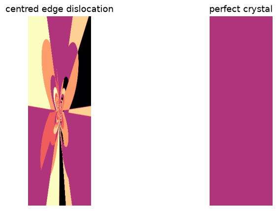
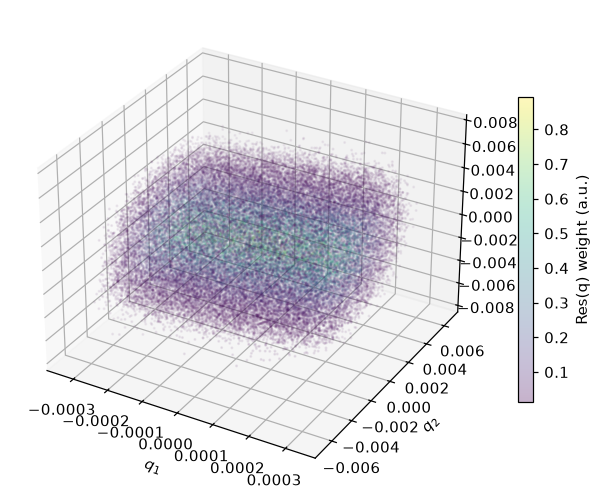
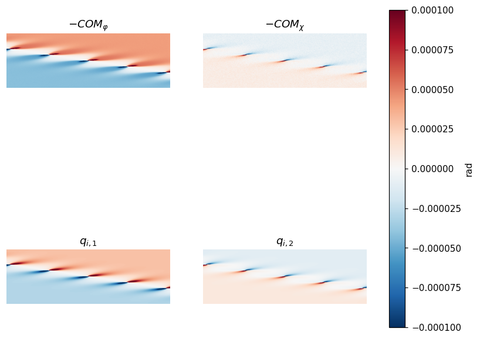
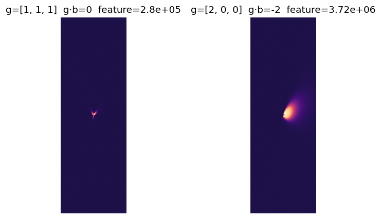
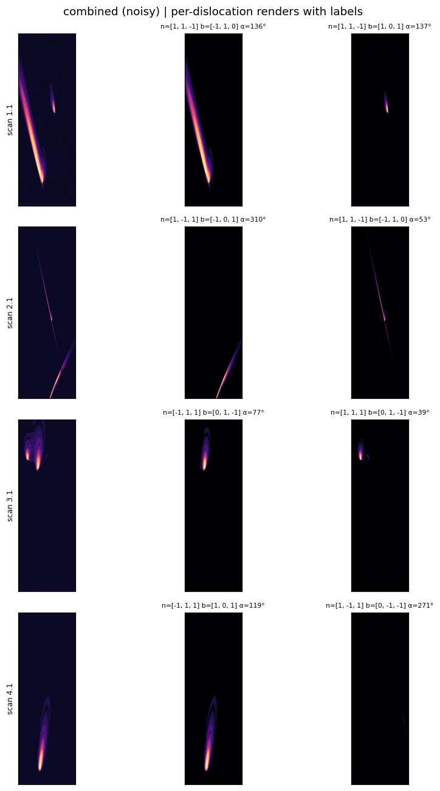

# Examples

## Tutorial series

Run each notebook from this `examples/` folder; notebooks are committed
**output-stripped** (`nbstripout`). The table below shows each notebook's key
figure (preview images included for read-only browsing without running). To
*run* a notebook, clone this repo and install the package
(`pip install -e ".[dev]"`) — the `.ipynb` alone is not enough. Rendered HTML
exports are large and regenerable, so they are not committed — generate them
yourself or ask for a copy.

| Notebook | Shows | Preview |
|---|---|---|
| [01 · Quickstart](01_quickstart.ipynb) | empty TOML → first image; the two-stage model |  |
| [02 · Reciprocal space](02_reciprocal_space.ipynb) | the resolution kernel; MC vs analytic backend |  |
| [03 · Dislocations & contrast](03_dislocations_and_contrast.ipynb) | character sweep, weak beam, COM ≈ −qi |  |
| [04 · Oblique & reflections](04_oblique_and_reflections.ipynb) | mounts, reflection tables, g·b invisibility |  |
| [05 · Identification at scale](05_identification_at_scale.ipynb) | labelled ML datasets, fan-out throughput |  |

Citations: [docs/references.md](../docs/references.md). CI executes
notebooks 01–03 on every push (`.github/workflows/notebooks.yml`).

## In-depth examples

### `identification_ml_tutorial/` — ML workflow tutorial

`dfxm_identify_ml_tutorial.ipynb` is a self-contained tutorial: it builds a
resolution kernel, generates a tiny labeled dataset with `dfxm-identify`, shows
the HDF5 layout, the per-image labels your model trains on, the images
themselves, and how to scale to 100k+ images on a cluster. It regenerates all of
its own inputs, so a fresh clone runs it end to end (~2 min headless).

```bash
jupyter lab examples/identification_ml_tutorial/dfxm_identify_ml_tutorial.ipynb
# or render to HTML with outputs:
jupyter nbconvert --to html --execute \
  examples/identification_ml_tutorial/dfxm_identify_ml_tutorial.ipynb
```

### `cluster_showcase/` — cluster fan-out visualization

`showcase.ipynb` visualizes the output of an actual cluster identify fan-out
(`scripts/fanout.py --mode identify` / `lsf/identify_array.bsub`). It loads a
`presentation_assets/` directory — detector frames, the per-frame rotations, and
a `summary.json` produced by the sweep — and plots them.

`presentation_assets/` is **gitignored** (a large, machine-specific cluster
output), so it is not in the repo. To reproduce the figures, run your own sweep
and drop the resulting `presentation_assets/` next to the notebook or at the repo
root — the notebook searches CWD then walks up. To render without re-running
(keeping the outputs already in the notebook):

```bash
jupyter nbconvert --to html examples/cluster_showcase/showcase.ipynb
```
